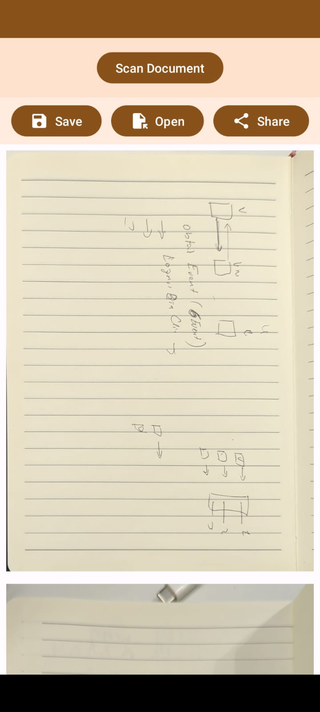
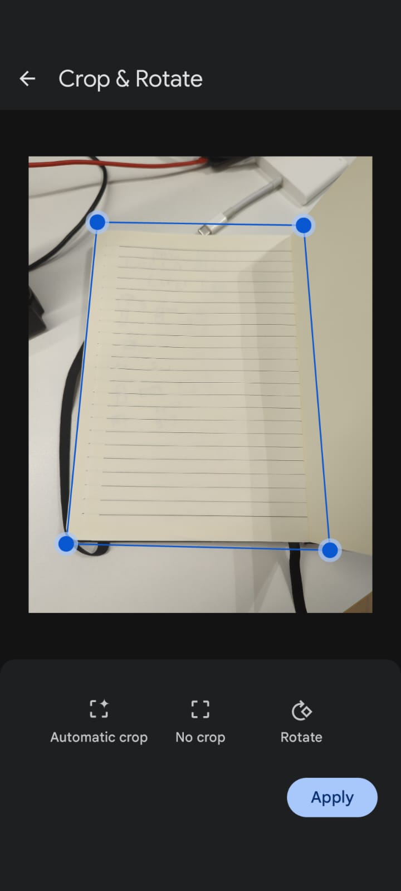
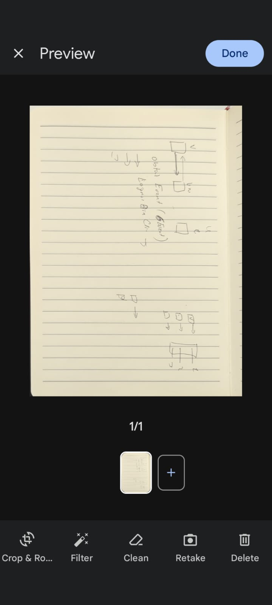

# ScannerApp

## About The Project

ScannerApp is a Android application, Developed with Android Compose.
<br/>
Using google libray:  ```mlkit-document-scanner ```
<br/>
After scening the document you can Share or Save the file as PDF foramt

### Installation

1. Clone the repo
   ```sh
   git clone https://github.com/davidHarush/ScannerApp.git


### Screenshots

<p float="left">
  
  
   
</p>


